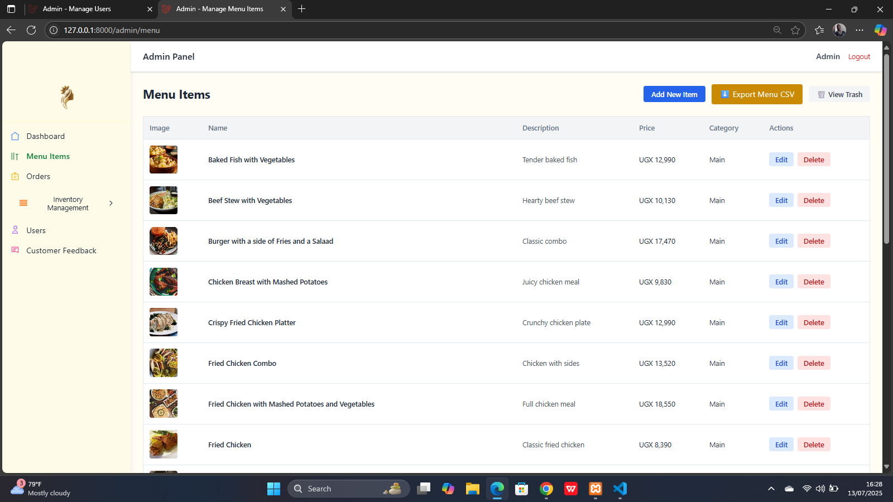

# 👑 Golden Queen Management System

Golden Queen is a Laravel QR-powered restaurant platform that offers mobile-first ordering, menu browsing, and feedback collection — built with elegance, precision, and purpose.

## ✨ Features

- 📱 Responsive public menu view with mobile-friendly layout
- 🖼️ QR code generation (SVG & PNG) for seamless ordering
- ✍️ Customer order form with table assignment and review
- 🔐 Role-based access for Admin, Worker, and Customer users
- 🧮 Inventory management with visual dashboards
- 📊 CSV export functionality for user and order data
- 🕒 Last login tracking for authenticated users
- 🧾 Admin panel for managing feedback, users, and menu items

## 🚀 Tech Stack

- Laravel 10
- Laravel Breeze (Authentication scaffolding)
- Tailwind CSS
- Blade Templates
- FontAwesome & Heroicons
- Simple QrCode (via SimpleSoftwareIO)
- MySQL

## 🧪 Setup Instructions

```bash
# Clone the repo
git clone https://github.com/Willy-Akampurira/golden-queen-management-system.git
cd golden-queen-management-system

# Install dependencies
composer install
npm install && npm run dev

# Configure environment
cp .env.example .env
php artisan key:generate

# Migrate database & seed starter data
php artisan migrate --seed

# Launch locally
php artisan serve

## 📸 Screenshots

### 🧭 Public Menu
- 
- 
- 
- 
- 
- 

### 🧑‍💼 Admin Panel
- 
- 
- 
- 
- 
- 
- 
- 
- 
- 
- 
- 
- 
- 
- 
- 
- 
- 
- 
- 

### 👷 Worker Dashboard
- 
- 

### 🧍 Customer Profile
- 
- 
- 

### 🖼️ QR Code Management
- 


